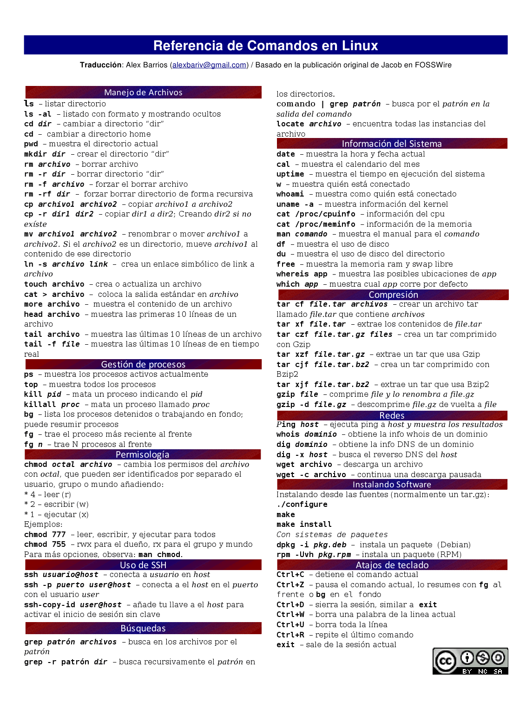
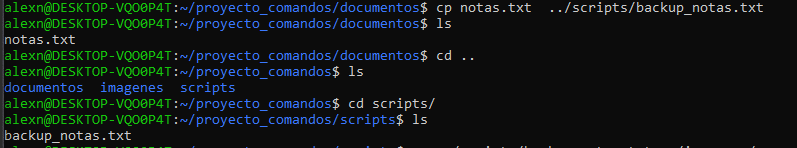

# TAS1 - Estructura 
## 1. Titulo
Comandos de Linux: Manipulación de Archivos y Directorios desde la Terminal
## 2. Tiempo de duración
El tiempo fue de 120 minutos. 
## 3. Fundamentos:

## WSL

Subsistema de Windows para Linux (WSL) es una característica de Windows que permite ejecutar un entorno Linux en la máquina Windows, sin necesidad de una máquina virtual independiente o arranque dual. WSL está diseñado para proporcionar una experiencia perfecta y productiva para los desarrolladores que quieren usar Windows y Linux al mismo tiempo (_¿Qué Es El Subsistema de Windows Para Linux? | Microsoft Learn_, n.d.).

- Use WSL para instalar y ejecutar varias distribuciones de Linux, como Ubuntu, Debian, Kali.
- Almacene archivos en un sistema de archivos Linux aislado, específico de la distribución instalada.
- Ejecute herramientas de línea de comandos, como BASH.
- Ejecute herramientas comunes de línea de comandos de BASH, como `grep`, `sed`, `awk`u otros archivos binarios ELF-64.
- Ejecute scripts de Bash y aplicaciones de línea de comandos GNU/Linux, entre las que se incluyen:
    - Herramientas: vim, emacs, tmux
    - Lenguajes: NodeJs, JavaScript, Python, Ruby, C/C++, C# & F#, Rust, Go, etc.
    - Servicios: SSHD, MySQL, Apache, lighttpd, MongoDB, PostgreSQL.
- Instale software adicional con su propio administrador de paquetes de distribución GNU/Linux.
- Invoque aplicaciones de Windows mediante un Shell de línea de comandos similar a Unix.
- Invoque aplicaciones GNU/Linux en Windows.

## Comandos de Linux

Los comandos de Linux permite controlar el sistema desde la interfaz de linea de comandos (CLI). Son instrucciones de texto introducidas en el terminal para indicarle a tu sistema exactamente que hacer. Los comandos que se ingresan en el terminal distinguen entre mayúsculas y minúsculas y siguen una sintaxis como "comando-opciones argumentos" (_Top 100 Comandos Linux (Que Debes Conocer) - DreamHost_, n.d.).

- **Son sensibles a mayúsculas y minúsculas**; por ejemplo, “ls” y “LS” significan cosas diferentes.
- **Siguen una sintaxis específica** como “comando -opciones argumentos“.
- **Se pueden combinar** para realizar operaciones complejas mediante pipelines y redirecciones.
- **Proporcionan un control detallado** sobre tu sistema, algo difícil de lograr con interfaces gráficas.
- **Permiten automatizar tareas** mediante scripts de Shell y procesamiento por lotes.
- **Se pueden utilizar para acceder a recursos del sistema** como el sistema de archivos, red, memoria y CPU.
- **Forman la base de la interacción** con servidores y sistemas operativos Linux.

## 4. Conocimientos previos.
   
Para realizar esta practica el estudiante necesita tener claro los siguientes temas:
- Comandos básicos de Linux.
- Navegación entre directorios desde la terminal. 
- Uso de editores de texto como nano o vim.
- Gestión de archivos(crear, copiar, mover, eliminar). 

## 5. Objetivos a alcanzar
   
- Crear una estructura de directorios utilizando comandos de terminal.
- Manipular archivos de texto dentro de directorios específicos.
- Redirigir y concatenar contenido entre archivos.
- Eliminar archivos y carpetas desde la terminal.
- Registrar comandos utilizados mediante **history**.
  
## 6. Equipo necesario:
  
- Computador con sistema operativo Linux/WSL/GitBash.
- Terminal funcional con acceso a comandos Bash.
- Editor de texto en terminal(nano, vim).
- Conexión a internet para búsqueda de documentación. 
## 7. Material de apoyo.
   
- Documentación de Linux.
- Guía de asignatura.
- Linux Command Cheat Sheet. 
- Videos tutoriales de comandos en terminal.
## 8. Procedimiento

### Pasos 

**Crear una estructura de carpetas:**

1. En tu directorio de trabajo, crea una carpeta llamada proyecto_comandos.

Figura 8-1 Creación de carpeta.

2. Dentro de proyecto_comandos, crea tres subcarpetas: documentos, imágenes y scripts.

Figura 8-2 Estructura inicial de carpetas creada con mkdir.

**Manipulación de archivos:**

3. Dentro de la carpeta documentos, crea un archivo de texto llamado notas.txt.

Figura 8-3 Creacion del archivo notas.txt usando touch.

4. Agrega al menos tres líneas de texto en notas.txt utilizando un editor de texto en la terminal (nano, vim) o con redireccionamiento (echo).

Figura 8-4 Agregación de contenido mediante redireccionamiento.  

5. Copia el archivo notas.txt a la carpeta scripts y cambia su nombre a backup_notas.txt.

Figura 8-5 Copia de archivos y cambio de nombre.

6. Mueve el archivo backup_notas.txt a la carpeta imágenes.

Figura 8-6 Movimiento de archivos

**Redirección y concatenación:**

7. Crea un archivo llamado resumen.txt en documentos.

Figura 8-7 Creacion de archivo. 

8. Redirecciona el contenido de notas.txt a resumen.txt.
9. Añade una nueva línea de texto a resumen.txt sin sobrescribir su contenido.

Figura 8-8 Redirección de contenido y adición de una nueva linea. 

**Eliminación de archivos y carpetas:**

10. Elimina el archivo backup_notas.txt de la carpeta imágenes.
11. Elimina la carpeta imágenes (solo si está vacía).

Figura 8-9 Eliminación de archivo y carpeta.

**Entrega**:

12. Vuelca el contenido del comando history a un archivo llamado tarea-s1-nombre_apellido.txt utilizando tuberías.

Figura 8-10 Lista de comandos con history.

12. Sustituye "nombre_apellido" por tu nombre y apellido correspondiente.

Figura 8-11 Sustitución de nombre de archivo. 

## 9. Resultados esperados:
    
Al finalizar la práctica, se logró cumplir exitosamente cada uno de los objetivos planteados en el procedimiento. La estructura de carpetas fue creada correctamente utilizando comandos de Linux como `mkdir`, `cd` y `ls`, lo cual permitió organizar adecuadamente los archivos dentro del proyecto.

Dentro de la carpeta `documentos`, se generó el archivo `notas.txt` con tres líneas de contenido, el cual fue creado utilizando el comando `echo` y verificado con `cat`, luego este archivo fue copiado y renombrado como `backup_notas.txt` en la carpeta `scripts` utilizando el comando `cp`, y luego movido a la carpeta `imagenes` con `mv`.

Se trabajó con redirección de contenido mediante el uso de `>` para crear el archivo `resumen.txt` y `>>` para añadir una nueva línea sin sobrescribir la información existente. Se eliminaron correctamente archivos y carpetas mediante `rm` y `rmdir`. Finalmente, el historial de comandos ejecutados durante toda la práctica fue volcado en un archivo `tarea-s1-nombre_apellido.txt` utilizando una tubería con `history` y `>`.

Cada paso fue documentado con capturas de pantalla para evidencia  del uso correcto de los comandos y la progresión del trabajo. Estos resultados reflejan la comprensión del manejo de la terminal y de operaciones básicas en entornos basados en Linux.

## 10. Bibliografía
    
- _¿Qué es el Subsistema de Windows para Linux?_ _| Microsoft Learn_. (n.d.). Retrieved April 4, 2025, from https://learn.microsoft.com/es-es/windows/wsl/about
- _Top 100 Comandos Linux (Que Debes Conocer) - DreamHost_. (n.d.). Retrieved April 4, 2025, from https://www.dreamhost.com/blog/es/comandos-linux-que-debes-conocer/
